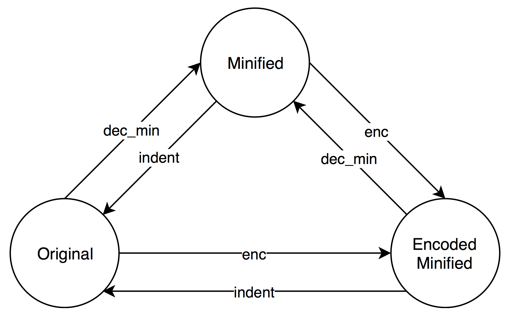

# Bookmarklets

Collecting bookmarklets in use.

## Requirements

`pip install -r requirements.txt`

### `slimit` Warnings

These `slimit` warning messages means outdated lex/yacc tables,
remove and regenerate them.

```
WARNING: Couldn't write lextab module <module 'slimit.lextab' from '...'>.
Won't overwrite existing lextab module

WARNING: Couldn't create <module 'slimit.yacctab' from '...'>.
Won't overwrite existing yacctab module
```

## Minify/Beautify Javascript

* Minify/beautify/encode/decode with the binaries

    Action   | Sample Commands
    ---------|---------------------------------------------------------------------------
    Minify   | `cat enable_scroll.js | python bin/dec_min.py > enable_scroll.min.js`
    Beautify | `cat enable_scroll.min.js | python bin/indent.py > enable_scroll.js`
    Encode   | `cat enable_scroll.min.js | python bin/enc.py > enable_scroll.enc.js`
    Decode   | `cat enable_scroll.enc.js | python bin/dec_min.py > enable_scroll.min.js`

* Transitions between states are as the following image

    
